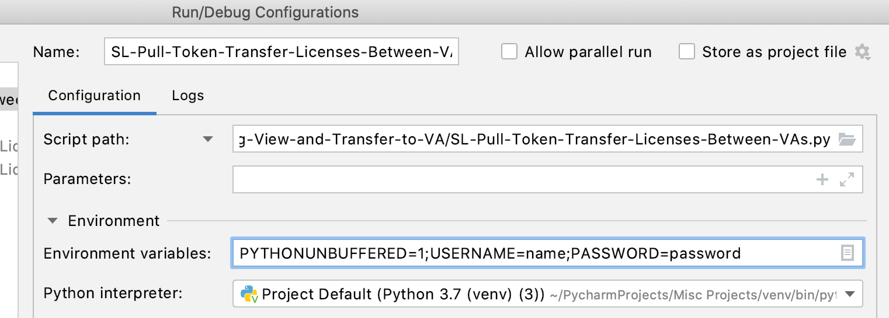

# **Smart Licensing Transfer (SLT) Tool**
The Smart Licensing Transfer (SLT) tool is a Python application that utilizes Cisco Smart Account and Licensing API's to automate the workflow of transferring Smart Licenses between Virtual Accounts. The tool supports user input for quick transfers, and also supports bulk license transfers.

#### **Team Members**
* Aaron Warner <aawarner@cisco.com> - US Public Sector
* Justin Poole <jupoole@cisco.com> - Global Enterprise Segment

#### **Table of Contents:**
* [Overview of Solution Components](#overview-of-solution-components)
* [SLT Process Workflow](#slt-process-workflow)
* [Requirements](#requirements)
* [Step-by-Step Setup & Operation](#step-by-step-setup-&-operation)
* [License](#license)
* [Technical Support](#technical-support)
  
#### **Overview of Solution Components**
* [Python 3](https://www.python.org/)
* [Cisco API Console](https://apiconsole.cisco.com/docs/read/overview/Platform_Introduction)
* [Cisco Smart Account and Licensing API](https://anypoint.mulesoft.com/apiplatform/apx/#/portals/organizations/1c92147b-332d-4f44-8c0e-ad3997b5e06d/apis/5418104/versions/102456)
* [Cisco Smart Software Manager](https://www.cisco.com/c/en/us/buy/smart-accounts/software-manager.html)

#### **SLT Process Workflow**
The process workflow assumes the customer already has created a Smart Account (with associated Virtual Accounts) and licenses deposited to the "DEFAULT" VA. The workflow steps are:


#### **Requirements**
Python 3 with these packages:
* json
* os
* sys
* request

#### **Step-by-Step Setup & Operation**

1.) Request API access and register SLT Application - Follow the [Request API Access Guide](https://apidocs-prod.cisco.com/?path=requestapiinfo)
    
* Ensure "Client Credentials Grant" & "Resource Owner Grant" is selected
* Copy "client_id" and "client_secret" credentials and store in a **safe** location

2.) Install Python 3 and required packages. See [Requirements](#requirements)

3.) Clone the BLT repository from Github/DEVNET

4.) Setup local Python environment 

* Ensure the "creds.json" file contains the "client_id" and "client_secret" is the correct format
```
   creds.json Format
   
{"client_id": "xxxxxxxxxxxxxxxxxxxxx", "client_secret": "xxxxxxxxxxxxxxxx"}
```
* Ensure Python "Environment Variables" for USERNAME= AND PASSWORD= are set in the IDE



5.) Run the Python script to transfer licenses as needed. 
```
python SL-Pull-Token-Transfer-Licenses-Between-VAs.py
```

*Note, the script references the "licenses.json" for bulk transfers first. If the file is not present, the script prompts the user for input.
```
    licences.json Format
[
{
    "smart_account": "smart account domain here",
    "transfer_from_va": "virtual account transferring licenses from here",
    "transfer_to_va": "virtual account transferring licenses to here",
    "license": "license name here",
    "licenseType": "license type here PERPETUAL or TERM",
    "quantity": 10000
  },
  {
    "smart_account": "smart account domain here",
    "transfer_from_va": "virtual account transferring licenses from here",
    "transfer_to_va": "virtual account transferring licenses to here",
    "license": "license name here",
    "licenseType": "license type here PERPETUAL or TERM",
    "quantity": 10000
  }
]
```

#### **License**
* Provided under Cisco Sample Code License, for details see [LICENSE](./LICENSE)

#### **Technical Support**
* For any questions/clarifications, please reach out to the operations team at <smart-operations@cisco.com>.
API access support can usually be expected within 48 hours response to the support ticket – 24h / 5 weekdays.
