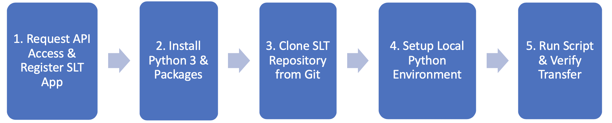

# **Smart Licensing Transfer (SLT) Tool**
The Smart Licensing Transfer (SLT) tool is a Python application that utilizes Cisco Smart Account and Licensing API's to automate the workflow of transferring Smart Licenses between Virtual Accounts. The tool supports user input for quick transfers, and also supports bulk license transfers.

#### **Team Members**
* Aaron Warner <aawarner@cisco.com> - US Public Sector
* Justin Poole <jupoole@cisco.com> - Global Enterprise Segment

#### **Table of Contents:**
* [Overview of Solution Components](#overview-of-solution-components)
* [SLT Process Workflow](#slt-process-workflow)
* [Requirements](#requirements)
* [Setup and Operation](#setup-and-operation)
* [License](#license)
* [Technical Support](#technical-support)
  
#### **Overview of Solution Components**
* [Python 3](https://www.python.org/)
* [Cisco API Console](https://apiconsole.cisco.com/docs/read/overview/Platform_Introduction)
* [Cisco Smart Account and Licensing API](https://anypoint.mulesoft.com/apiplatform/apx/#/portals/organizations/1c92147b-332d-4f44-8c0e-ad3997b5e06d/apis/5418104/versions/102456)
* [Cisco Smart Software Manager](https://www.cisco.com/c/en/us/buy/smart-accounts/software-manager.html)

#### **SLT Process Workflow**
The process workflow assumes the customer already has created a Smart Account (with associated Virtual Accounts) and licenses deposited to the "DEFAULT" VA. The workflow steps are:



#### **Requirements**
Python 3 with this package:
* request

#### **Setup and Operation**

1.) Request API access and register SLT Application - Follow the [Request API Access Guide](https://apidocs-prod.cisco.com/?path=requestapiinfo)
    
* Ensure "Client Credentials Grant" & "Resource Owner Grant" is selected
* Copy "client_id" and "client_secret" credentials and store in a **safe** location

2.) Install Python 3 and required package. See [Requirements](#requirements)
```
pip install request
```

3.) Clone the SLT repository from Github

* Github link: [SLT](https://github.com/ogjp/Smart-Licensing-Transfer-Tool.git)

4.) Setup local Python environment 

* Create the "creds.json" file and place in the same directory as the script. Ensure the file contains the "client_id" and "client_secret" in the correct json format:

```   
{"client_id": "xxxxxxxxxxxxxxxxxxxxx", "client_secret": "xxxxxxxxxxxxxxxx"}
```
* Ensure Python import the "Environment Variables" for "USERNAME=myname" AND "PASSWORD=mypass". These values can be set in an IDE or in the user OS profile. For example:

```
export USERNAME="myname"
export PASSWORD="mypassword"
```

5.) Run the Python script to transfer licenses as needed. 

* The script looks for the "licenses.json" file to import customer/license data at run time. If the file is not present, the script prompts the user for manual input. The user should create the "licenses.json" file if not already present. NOTE - The CSSM API supports a maximum of 10 license "type" transfers per single request. The below example is considered two license types, each with 10,000 licenses. The "licenses.json" file must follow the format below:

```
[
{
    "smart_account": "smart account domain here",
    "transfer_from_va": "virtual account transferring licenses from here",
    "transfer_to_va": "virtual account transferring licenses to here",
    "license": "license name here",
    "licenseType": "license type here PERPETUAL or TERM",
    "quantity": 10000
  },
  {
    "smart_account": "smart account domain here",
    "transfer_from_va": "virtual account transferring licenses from here",
    "transfer_to_va": "virtual account transferring licenses to here",
    "license": "license name here",
    "licenseType": "license type here PERPETUAL or TERM",
    "quantity": 10000
  }
]
```

* Execute the script in terminal
```
python SL-Transfer-App.py
```

#### **License**
* Provided under Cisco Sample Code License, for details see [LICENSE](./LICENSE)

#### **Technical Support**
* For any questions/clarifications, please reach out to the operations team at <smart-operations@cisco.com>.
API access support can usually be expected within 48 hours response to the support ticket – 24h / 5 weekdays.
